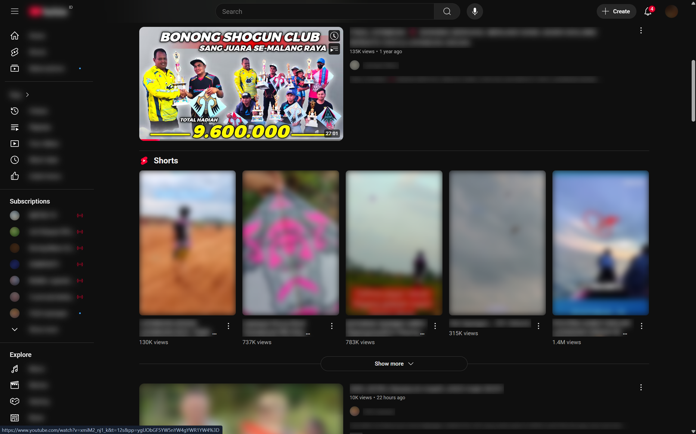

 

  

  <h3 align="center">All-In-One Privacy Extension</h3>

  

    A lightweight Chrome extension that lets you blur, dim, or hide specific elements on popular websites like YouTube, Twitter (X), and ChatGPT.
     
    <a href="https://github.com/naufalist/AIO-Privacy-Extension/releases">Release Notes</a>
    ·
    <a href="https://github.com/naufalist/AIO-Privacy-Extension/issues">Report Bug / Request Feature</a>
  

## About

This extension was built out of a personal need for screen privacy in open office environments, where people can walk by and easily glance at your screen. With this tool, you can selectively obscure parts of a page like thumbnails, usernames, or trending topics without needing to close or switch tabs.

 

  

(<a href="#top">back to top</a>)

## Features

- Blur or dim specific elements like video thumbnails, tweet text, sidebar icons, etc.
- Customize blur strength or opacity levels.
- Multi-site support (YouTube, Twitter/X, ChatGPT, and more).
- Quick toggle for enabling/disabling effects.
- Optional hover-to-unblur behavior for convenience.

(<a href="#top">back to top</a>)

## Supported Sites & Features

> :information_source: You can toggle each feature individually in the extension popup, and some features support "hover to unblur" unless `nohover` is enabled.

<table>
  <thead>
    <tr>
      <th>#</th>
      <th style="text-align:center; vertical-align: top;">Site</th>
      <th>Supported Features</th>
    </tr>
  </thead>
  <tbody>
    <tr>
      <td>1</td>
      <td style="text-align:center; vertical-align: top;"><strong>YouTube</strong></td>
      <td>
        <ul>
          <li>Blur logo</li>
          <li>Blur video titles</li>
          <li>Blur thumbnails (main, compact, mix)</li>
          <li>Blur channel pictures</li>
          <li>Blur channel names</li>
          <li>Blur watch title (on video page)</li>
          <li>Blur video descriptions</li>
          <li>Blur playlist titles</li>
          <li>Blur playlist bylines</li>
          <li>Blur sidebar subscriptions</li>
          <li>Blur Shorts titles</li>
          <li>Blur Shorts thumbnails</li>
          <li>Blur Mix titles (main view & playlist)</li>
          <li>Blur Mix channel names</li>
          <li>Reduce opacity for search box input</li>
          <li>Reduce opacity for search suggestions</li>
          <li>Supports hover-to-unblur for each feature</li>
        </ul>
      </td>
    </tr>
    <tr>
      <td>2</td>
      <td style="text-align:center; vertical-align: top;"><strong>Twitter / X</strong></td>
      <td>
        <ul>
          <li>Blur tweet content</li>
          <li>Blur trending topics</li>
          <li>Blur sidebar icons</li>
          <li>Supports hover-to-unblur for each feature</li>
        </ul>
      </td>
    </tr>
    <tr>
      <td>3</td>
      <td style="text-align:center; vertical-align: top;"><strong>ChatGPT</strong></td>
      <td>
        <ul>
          <li>Blur sidebar titles (chat names)</li>
          <li>Blur chat section blocks (text messages)</li>
          <li>Reduce opacity for prompt input box</li>
          <li>Supports hover-to-unblur for each feature</li>
        </ul>
      </td>
    </tr>
    <tr>
      <td>4</td>
      <td style="text-align:center; vertical-align: top;"><strong>Facebook (currently support messenger only)</strong></td>
      <td>
        <ul>
          <li>Blur avatars (sidebar + chat area)</li>
          <li>Blur display names in chat header</li>
          <li>Blur sidebar display names</li>
          <li>Blur sidebar chat previews</li>
          <li>Blur chat bubble text (with replies)</li>
          <li>Blur media in chats</li>
          <li>Reduce opacity of chat input text</li>
          <li>Supports hover-to-unblur for each feature</li>
        </ul>
      </td>
    </tr>
    <tr>
      <td>5</td>
      <td style="text-align:center; vertical-align: top;"><strong>Quora</strong></td>
      <td>
        <ul>
          <li>Blur article avatars</li>
          <li>Blur tribe/community display names</li>
          <li>Blur fallback names (e.g., Anonim)</li>
          <li>Blur user byline avatar (small)</li>
          <li>Blur user byline display name</li>
          <li>Blur user byline timestamp</li>
          <li>Blur article content titles (quote, preview, non-quote)</li>
          <li>Blur article content (text, list, images)</li>
          <li>Blur preview text (truncated summary)</li>
          <li>Blur background-image previews</li>
          <li>Supports hover-to-unblur for each feature</li>
        </ul>
      </td>
    </tr>
  </tbody>
</table>

(<a href="#top">back to top</a>)

## Built With

- HTML – For structuring the popup UI and options.
- CSS – For styling the popup, blur effects, and transitions.
- JavaScript (Vanilla JS) – For handling logic, Chrome extension messaging, storage, and DOM manipulation.

> :information_source: This extension does not rely on any frameworks or libraries like jQuery, Bootstrap, just pure HTML, CSS, and JavaScript.

(<a href="#top">back to top</a>)

## Setup for development purposes (Chrome browser)

1. Download the latest release from [here](https://github.com/naufalist/AIO-Privacy-Extension/releases) and extract the ZIP file.
2. Open [chrome://extensions](chrome://extensions) in your browser.
3. Enable **Developer Mode** using the toggle at the top right.
4. Click **"Load Unpacked"**.
5. Select the `/src` folder from the extracted files (make sure it stays in a permanent location to avoid accidental deletion).
6. Visit this page regularly to check for updates.

(<a href="#top">back to top</a>)

## Contributing

If you have a suggestion that would make this better, please fork the repo and create a pull request. You can also simply open an issue with the tag "enhancement".

(<a href="#top">back to top</a>)

## License

This repo is under [MIT License](https://opensource.org/licenses/mit-license.php)

(<a href="#top">back to top</a>)

## Acknowledgments

- [Eyes Icon](https://www.freepik.com/icon/eyes_4955440)

(<a href="#top">back to top</a>)

## Contact

[@naufalist](https://twitter.com/naufalist) - contact.naufalist@gmail.com

(<a href="#top">back to top</a>)

